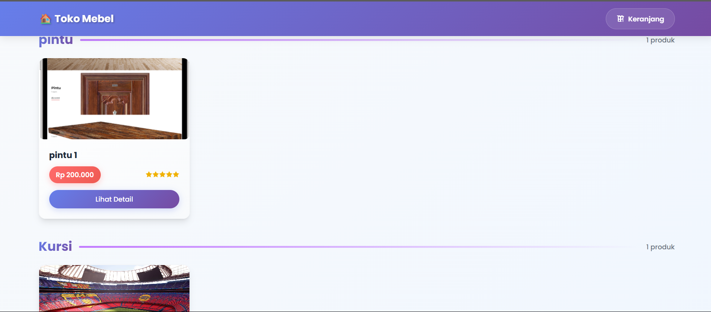
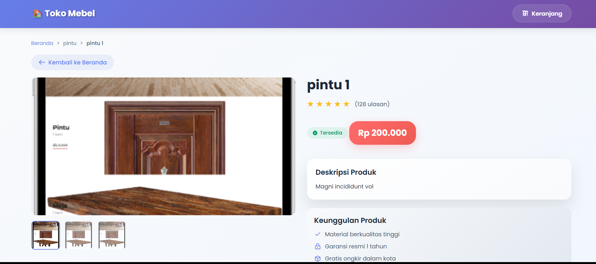
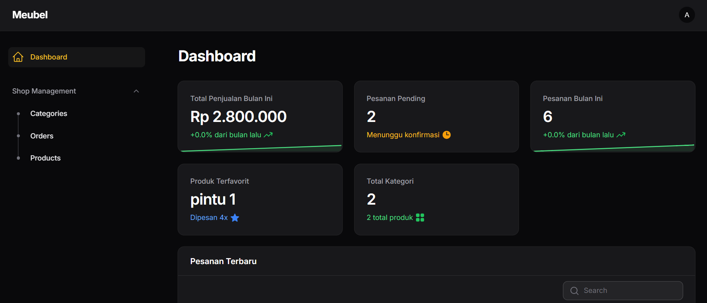
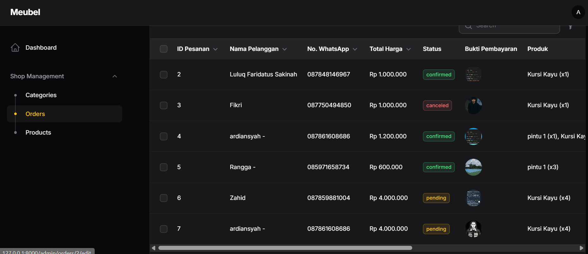
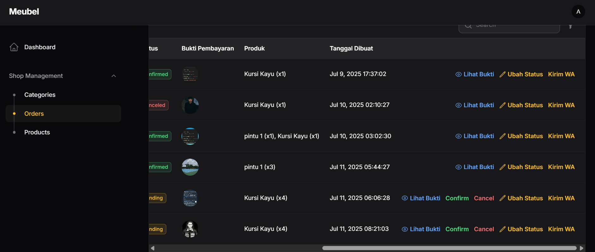
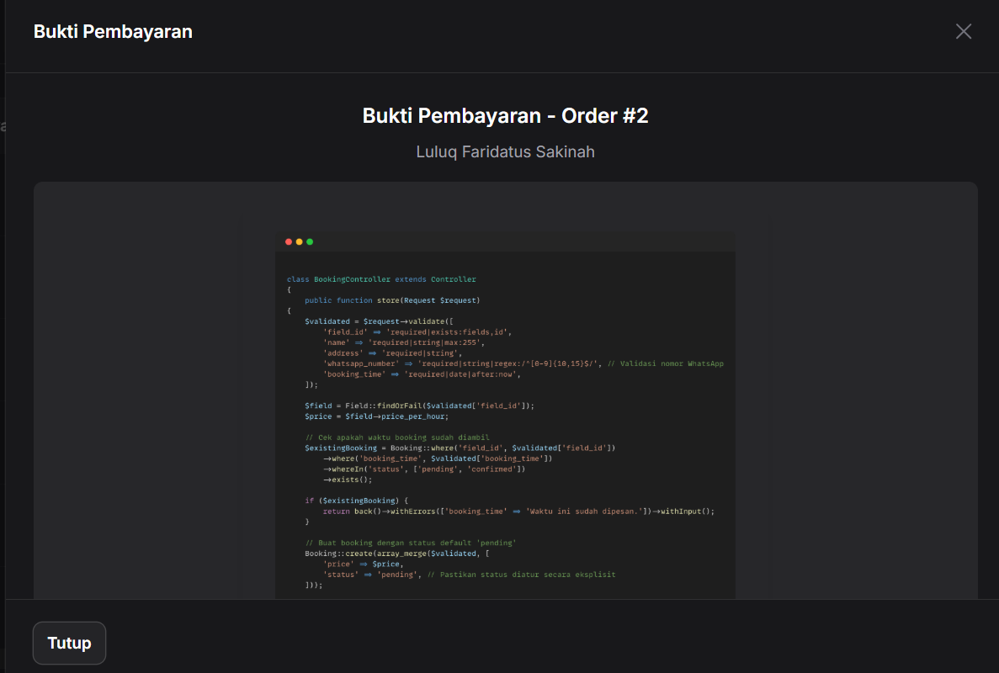

# 🛋️ Sistem Manajemen Pesanan Meubel

<div align="center">


**Sistem manajemen pesanan furniture modern dan elegan yang dibangun dengan Laravel dan Filament Admin Panel**

[Demo Langsung](https://demo.example.com) • [Dokumentasi](https://docs.example.com) • [Laporkan Bug](https://github.com/username/repo/issues) • [Request Fitur](https://github.com/username/repo/issues)

</div>

---

## 📋 Daftar Isi

- [Gambaran Umum](#-gambaran-umum)
- [Fitur](#-fitur)
- [Teknologi](#-teknologi)
- [Tampilan Aplikasi](#-tampilan-aplikasi)
- [Instalasi](#-instalasi)
- [Konfigurasi](#-konfigurasi)
- [Panduan Penggunaan](#-panduan-penggunaan)
- [Referensi API](#-referensi-api)
- [Kontribusi](#-kontribusi)
- [Lisensi](#-lisensi)
- [Dukungan](#-dukungan)

---

## 🎯 Gambaran Umum

**Sistem Manajemen Pesanan Meubel** adalah aplikasi web komprehensif yang dirancang untuk memperlancar operasi bisnis furniture. Dibangun dengan framework PHP modern, sistem ini menyediakan panel admin yang intuitif untuk mengelola pesanan pelanggan, melacak pembayaran, dan mengotomatisasi komunikasi pelanggan melalui integrasi WhatsApp.

### 🎨 Keunggulan Utama

- **Alur Kerja Efisien**: Kelola pesanan dari pembuatan hingga pengiriman
- **Pelacakan Real-time**: Monitor status pesanan dan konfirmasi pembayaran
- **Engagement Pelanggan**: Notifikasi WhatsApp otomatis
- **Interface Modern**: Dashboard admin yang bersih dan responsif
- **Arsitektur Scalable**: Dibangun di atas fondasi Laravel yang kuat

---

## ✨ Fitur

### 🔧 Fungsi Utama
- **📋 Manajemen Pesanan**: Kelola pesanan dari frontend pelanggan dan panel admin
- **👥 Database Pelanggan**: Sistem informasi pelanggan yang komprehensif
- **🛍️ Katalog Produk**: Kelola item furniture dengan spesifikasi detail
- **💰 Sistem Pembayaran**: Pelanggan upload bukti transfer, admin verifikasi
- **📊 Analitik Dashboard**: Insight visual tentang performa bisnis

### 🚀 Fitur Lanjutan
- **📱 Integrasi WhatsApp API**: Notifikasi pelanggan otomatis dengan template pesan yang rich
- **🔄 Alur Status Pesanan**: Pending → Dikonfirmasi → Dalam Proses → Dikirim
- **🖼️ Upload Bukti Transfer**: Pelanggan upload bukti pembayaran dari frontend
- **✅ Verifikasi Admin**: Admin review dan konfirmasi pembayaran
- **🔐 Akses Berbasis Peran**: Level izin admin dan staff
- **📱 Responsif Mobile**: Bekerja mulus di semua perangkat

### 🎨 Pengalaman Pengguna
- **🌟 Interface Intuitif**: Panel admin dan frontend pelanggan yang user-friendly
- **⚡ Performa Cepat**: Dioptimalkan untuk kecepatan dan efisiensi
- **🔍 Pencarian Lanjutan**: Lookup pesanan dan pelanggan dengan cepat
- **📱 Self-Service**: Pelanggan bisa upload bukti transfer sendiri
- **📈 Laporan**: Generate laporan bisnis yang detail

---

## 🛠️ Teknologi

### Backend
- **Framework**: Laravel 12.x
- **Panel Admin**: Filament v3
- **Database**: MySQL / MariaDB
- **Versi PHP**: 8.3+

### Frontend
- **Styling**: Tailwind CSS (via Filament)
- **Icons**: Heroicons
- **Components**: Livewire

### Development
- **Environment**: Laragon
- **Version Control**: Git
- **Package Manager**: Composer

---

## 📸 Tampilan Aplikasi

<div align="center">

### Tampilan Depan Pelanggan



### Gambaran Dashboard


### Manajemen Pesanan




### Detail Bukti Pembayaran


</div>

---

## 🚀 Instalasi

### Persyaratan Sistem
- PHP 8.1 atau lebih tinggi
- Composer
- Node.js & npm
- MySQL/MariaDB
- Web server (Apache/Nginx)

### Panduan Cepat

1. **Clone repository**
   ```bash
   git clone https://github.com/ardiansyah663/sistem-pesanan-meubel-laravel.git
   cd sistem-pesanan-meubel
   ```

2. **Install dependency PHP**
   ```bash
   composer install
   ```

3. **Install dependency Node.js**
   ```bash
   npm install
   ```

4. **Setup environment**
   ```bash
   cp .env.example .env
   php artisan key:generate
   ```

5. **Konfigurasi database**
   ```bash
   # Edit file .env dengan kredensial database Anda
   DB_DATABASE=meubel
   DB_USERNAME=username_anda
   DB_PASSWORD=password_anda
   ```

6. **Jalankan migrasi dan seeder**
   ```bash
   php artisan migrate --seed
   ```

7. **Link direktori storage**
   ```bash
   php artisan storage:link
   ```

8. **Build assets**
   ```bash
   npm run build
   ```

9. **Jalankan server development**
   ```bash
   php artisan serve
   ```

10. **Akses aplikasi**
    - **Frontend Pelanggan**: `http://localhost:8000`
    - **Panel Admin**: `http://localhost:8000/admin`

---

## ⚙️ Konfigurasi

### Akses Admin
Buat akun admin Anda:
```bash
php artisan make:filament-user
```

### Integrasi WhatsApp
Konfigurasi pengaturan WhatsApp di `.env`:
```env
WHATSAPP_ENABLED=true
WHATSAPP_BASE_URL=https://api.whatsapp.com/send/
WHATSAPP_COUNTRY_CODE=62
```

### Pengaturan Upload File
```env
FILESYSTEM_DISK=public
MAX_UPLOAD_SIZE=10240  # 10MB
```

### Konfigurasi Email
```env
MAIL_MAILER=smtp
MAIL_HOST=smtp-host-anda
MAIL_PORT=587
MAIL_USERNAME=email-anda
MAIL_PASSWORD=password-anda
```

---

## 📖 Panduan Penggunaan

### Alur Pesanan Pelanggan
1. **Pelanggan** mengakses website dan browse produk
2. **Pelanggan** membuat pesanan dengan detail produk
3. **Pelanggan** mengisi data diri dan alamat pengiriman
4. **Sistem** generate invoice dan detail pembayaran
5. **Pelanggan** upload bukti transfer melalui frontend
6. **Admin** menerima notifikasi pesanan baru
7. **Admin** verifikasi pembayaran dan update status
8. **Sistem** kirim konfirmasi WhatsApp ke pelanggan

### Mengelola Pesanan (Admin)
1. Akses dashboard admin di `/admin`
2. Lihat daftar pesanan masuk
3. Review bukti pembayaran yang diupload pelanggan
4. Verifikasi dan ubah status pesanan
5. Kirim notifikasi update ke pelanggan

### Proses Pembayaran
1. **Pelanggan** melihat detail pembayaran di halaman pesanan
2. **Pelanggan** melakukan transfer sesuai instruksi
3. **Pelanggan** upload foto/screenshot bukti transfer
4. **Admin** mendapat notifikasi pembayaran baru
5. **Admin** verifikasi dan konfirmasi pembayaran

### Notifikasi WhatsApp
Sistem otomatis mengirim pesan WhatsApp dengan detail lengkap untuk:
- **Konfirmasi pesanan** setelah pelanggan berhasil pesan
- **Konfirmasi pembayaran** setelah admin verifikasi bukti transfer
- **Update status** pesanan dengan timestamp
- **Notifikasi pengiriman** dengan tracking info

**Contoh pesan konfirmasi pembayaran:**
```
Hai [Nama Customer],

Pesanan Anda dengan ID #4 telah *DIKONFIRMASI*. ✅

Detail Pesanan:
• Pintu 1 (x1) - Rp 200.000
• Kursi Kayu (x1) - Rp 1.000.000

Total: Rp 1.200.000

Pembayaran telah dikonfirmasi pada: 10 Jul 2025 03:02

Bukti Pembayaran: [Link ke file]

Pesanan Anda sedang diproses dan akan segera dikirim.
Terima kasih atas kepercayaan Anda kepada kami! 🙏
```

---

## 🔌 Referensi API

### Autentikasi
```http
POST /api/auth/login
Content-Type: application/json

{
  "email": "admin@example.com",
  "password": "password"
}
```

### Endpoint Pesanan
```http
GET /api/orders
Authorization: Bearer {token}
```

### Buat Pesanan
```http
POST /api/orders
Authorization: Bearer {token}
Content-Type: application/json

{
  "customer_id": 1,
  "products": [
    {
      "id": 1,
      "quantity": 2,
      "price": 1500000
    }
  ],
  "notes": "Spesifikasi custom"
}
```

---

## 📊 Skema Database

### Tabel Users
```sql
CREATE TABLE users (
    id BIGINT UNSIGNED AUTO_INCREMENT PRIMARY KEY,
    name VARCHAR(255) NOT NULL,
    email VARCHAR(255) NOT NULL,
    email_verified_at TIMESTAMP NULL DEFAULT NULL,
    password VARCHAR(255) NOT NULL,
    remember_token VARCHAR(100) DEFAULT NULL,
    created_at TIMESTAMP NULL DEFAULT NULL,
    updated_at TIMESTAMP NULL DEFAULT NULL,
    UNIQUE KEY email (email)
);

```

### Tabel Orders
```sql
CREATE TABLE orders (
    id BIGINT UNSIGNED AUTO_INCREMENT PRIMARY KEY,
    customer_name VARCHAR(255) NOT NULL,
    customer_address TEXT NOT NULL,
    customer_phone VARCHAR(255) NOT NULL,
    products JSON NOT NULL,
    total_price DECIMAL(10,2) NOT NULL,
    status ENUM('pending', 'confirmed', 'canceled') NOT NULL DEFAULT 'pending',
    payment_proof VARCHAR(255) DEFAULT NULL,
    created_at TIMESTAMP NULL DEFAULT NULL,
    updated_at TIMESTAMP NULL DEFAULT NULL
);
```

### Tabel Products
```sql
CREATE TABLE products (
    id BIGINT UNSIGNED AUTO_INCREMENT PRIMARY KEY,
    name VARCHAR(255) NOT NULL,
    description TEXT DEFAULT NULL,
    price DECIMAL(10,2) NOT NULL,
    category_id BIGINT UNSIGNED NOT NULL,
    image VARCHAR(255) DEFAULT NULL,
    created_at TIMESTAMP NULL DEFAULT NULL,
    updated_at TIMESTAMP NULL DEFAULT NULL
);
```

### Tabel Categories
```sql
CREATE TABLE categories (
    id BIGINT UNSIGNED AUTO_INCREMENT PRIMARY KEY,
    name VARCHAR(255) NOT NULL,
    created_at TIMESTAMP NULL DEFAULT NULL,
    updated_at TIMESTAMP NULL DEFAULT NULL
);
```

---

## 🤝 Kontribusi

Kami menyambut kontribusi! Silakan ikuti langkah-langkah berikut:

1. **Fork repository**
2. **Buat feature branch**
   ```bash
   git checkout -b feature/fitur-keren
   ```
3. **Commit perubahan Anda**
   ```bash
   git commit -m 'Tambah fitur keren'
   ```
4. **Push ke branch**
   ```bash
   git push origin feature/fitur-keren
   ```
5. **Buka Pull Request**

### Panduan Development
- Ikuti standar coding PSR-12
- Tulis test yang komprehensif
- Update dokumentasi
- Tambahkan commit message yang bermakna

---

## 🧪 Testing

Jalankan test suite:
```bash
# Jalankan semua test
php artisan test

# Jalankan dengan coverage
php artisan test --coverage

# Jalankan file test tertentu
php artisan test tests/Feature/OrderTest.php
```

---

## 📱 Dukungan Mobile

Aplikasi ini sepenuhnya responsif dan dioptimalkan untuk:
- 📱 Perangkat mobile (iOS/Android)
- 📱 Tablet
- 💻 Komputer desktop
- 🖥️ Layar besar

---

## 🔒 Keamanan

- **Autentikasi**: Laravel Sanctum
- **Autorisasi**: Permission berbasis peran
- **Validasi Data**: Validasi server-side
- **Upload File**: Penanganan file yang aman
- **SQL Injection**: Perlindungan Eloquent ORM

---

## 📈 Performa

- **Caching**: Dukungan Redis
- **Database**: Optimasi query
- **Assets**: Minifikasi dan kompresi
- **Images**: Optimasi otomatis

---

## 🌍 Lokalisasi

Bahasa yang didukung:
- 🇮🇩 Bahasa Indonesia
- 🇺🇸 English

Tambahkan bahasa baru dengan membuat file terjemahan di `resources/lang/`.

---

## 📚 Dokumentasi

- [Panduan Instalasi](docs/instalasi.md)
- [Manual Pengguna](docs/panduan-pengguna.md)
- [Dokumentasi API](docs/api.md)
- [Panduan Deployment](docs/deployment.md)

---

## 🚀 Deployment

### Setup Produksi
```bash
# Optimasi untuk produksi
php artisan optimize
php artisan config:cache
php artisan route:cache
php artisan view:cache

# Set permission yang tepat
chmod -R 755 storage/
chmod -R 755 bootstrap/cache/
```

### Dukungan Docker
```bash
# Build dan jalankan dengan Docker
docker-compose up -d
```

---

## 🐛 Troubleshooting

### Masalah Umum

**Storage link tidak berfungsi?**
```bash
php artisan storage:link
```

**Error permission denied?**
```bash
sudo chown -R www-data:www-data storage/
sudo chown -R www-data:www-data bootstrap/cache/
```

**Database connection failed?**
- Periksa kredensial database di `.env`
- Pastikan MySQL/MariaDB berjalan
- Verifikasi database sudah ada

---

## 📄 Lisensi

Proyek ini dilisensikan di bawah MIT License. Lihat file [LICENSE](LICENSE) untuk detail.

---

## 🙏 Penghargaan

- [Laravel](https://laravel.com/) - Framework PHP
- [Filament](https://filamentphp.com/) - Framework admin panel
- [Tailwind CSS](https://tailwindcss.com/) - Utility-first CSS framework
- [Heroicons](https://heroicons.com/) - Icon SVG yang indah

---

## 📞 Dukungan

<div align="center">

### Butuh Bantuan?

[](https://github.com/username/repo/issues)
[](https://github.com/username/repo/discussions)

**📧 Email**: diansiahaan663@gmail.com 
**💬 WhatsApp**: +62 878-6160-8686  
**🌐 Website**: -

</div>

---

<div align="center">

**Dibuat dengan ❤️ untuk bisnis furniture Indonesia**

⭐ **Star repository ini jika membantu!** ⭐

</div>
